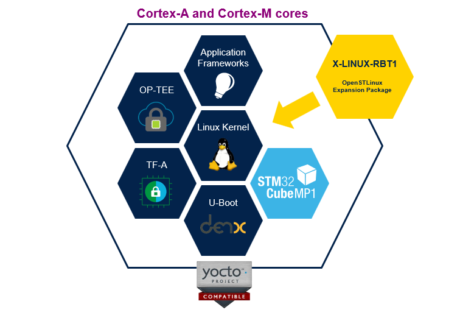
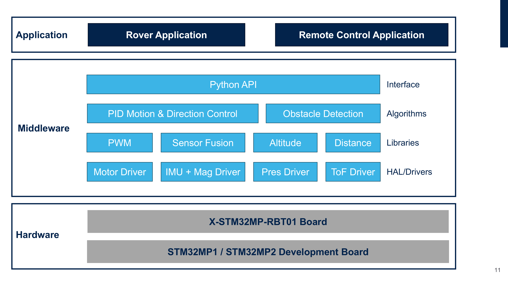
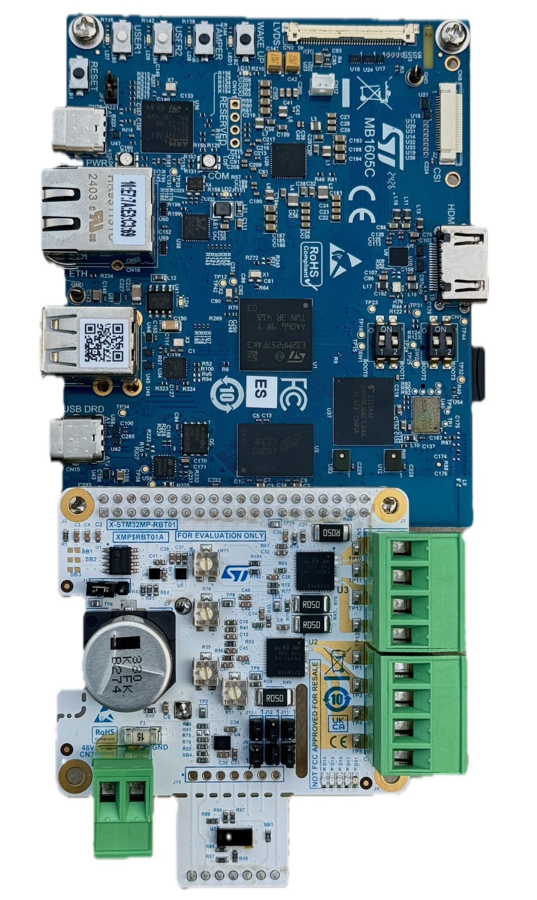
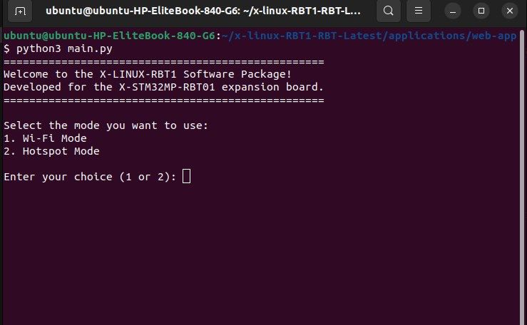
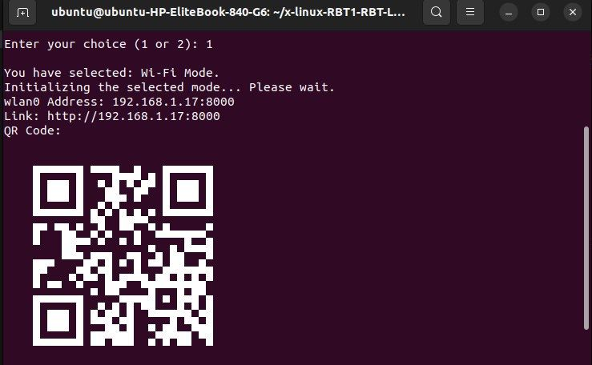
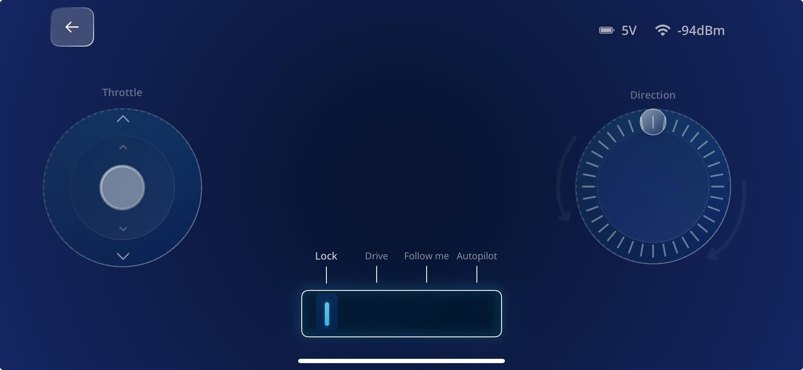

# X-LINUX-RBT1 V1.0.0 Linux Package

## Introduction

The **X-LINUX-RBT1** is a Linux-based expansion software package designed for robotics application development on STM32MP and other microprocessor platforms. It provides drivers, APIs, and applications tailored for the X-STM32MP-RBT01 board, which features the STSPIN948 motor driver. This package serves as a foundational tool for engineers to build complex robotics solutions.



## Description

### Software Features

The **X-LINUX-RBT1** package includes a range of features for robotics control and development:

1. Commandline based terminal application.
2. Embedded web server with a web client for remote network control.
3. Intuitive joystick-based remote control web app.
4. Sensor fusion middleware for precise heading and orientation.
5. ToF-based (Time-of-Flight) obstacle detection.
6. Emergency stop functionality triggered by motor faults, user input, collisions, or topples.
7. Data logging capabilities for debugging and AI training.

### X-LINUX-RBT1 Architecture

The package is composed of multiple layers and modules:

#### 1. **Hardware Drivers and APIs**
- Kernel and device tree patches included in the package expose components like LSM6DSV16X (IMU), LPS22HH (Pressure Sensor), and IIS2MDC (Magnetometer) via the Linux IIO subsystem.
- User-space Python drivers are provided for components like STSPIN948 (Motor Driver) and VL53L5CX (ToF Sensor), with low-level I2C, PWM, and GPIO configurations handled via device tree patches.

#### 2. **Sensor Algorithms**
- Compute useful metrics from raw sensor data, such as altitude from pressure readings, distances from ToF sensor data, and orientation using sensor fusion.

#### 3. **Robotics Algorithms**
- High-level algorithms tailored for robotics, including kinematics, obstacle detection etc.

#### 4. **Applications**
- Includes sample applications demonstrating practical use cases, such as remote rover control, integrating all modules into cohesive robotics solutions.



Engineers can develop custom applications leveraging the APIs and drivers provided in this package.

## Hardware Setup

The current package provides software support for [X-STM32MP-RBT01](https://www.st.com/en/evaluation-tools/evspin948.html) expansion board.


Key STMicroelectronics components available on this board are described below:

- [STSPIN948](https://www.st.com/en/motor-drivers/stspin948.html): A 4.5 A dual full-bridge driver for brushed DC motors or bipolar stepper motors. Amplifiers for current sensing and adjustable slew-rate for EMI performance tweaking are other notable features.
- [VL53L5CX](https://www.st.com/en/imaging-and-photonics-solutions/vl53l5cx.html): A state-of-the-art, Time-of-Flight (ToF) multizone ranging sensor.
- [LSM6DSV16X](https://www.st.com/en/mems-and-sensors/lsm6dsv16x.html): A high-performance, low-power 6-axis IMU. It incorporates edge computing features like a finite state machine (FSM) for motion tracking and a machine learning core (MLC) for AI-driven context awareness. The IMU also includes Qvar for gesture detection.
- [LPS22HH](https://www.st.com/en/mems-and-sensors/lps22hh.html): An ultra-compact piezoresistive absolute pressure sensor.
- [IIS2MDC](https://www.st.com/en/mems-and-sensors/iis2mdc.html): A high-accuracy, ultra-low-power 3-axis digital magnetic sensor.

The *X-STM32MP-RBT01* board can be plugged into the 40-pin connectors available on STM32MP discovery boards or Raspberry Pi, as shown below.





### Important Setup Notes

- Ensure correct board orientation when mounting on platforms like STM32MP discovery kits or Raspberry Pi. For example, the board mounts "inward" on STM32MP157F-DK2 & Raspberry Pi but "outward" on STM32MP257F-DK boards.
- Verify jumper settings for the STSPIN948 to operate in "Dual Independent Full Bridge Mode" as configured in the provided software. For other configurations, modify the user-space driver code.
- Some GPIOs connected to the 40-pin headers are shared with other peripherals on STM32MP boards and may require the connection/disconnection of solder bridges. For example, in the STM32MP157F-DK2 board SB13, SB14, SB15, SB16 should be closed and SB01, SB02, SB03 and SB04 should be opened by desoldering the 0 ohm resistor. Refer to the specific board user manual for details.

## Software Setup

This section describes the software setup required for building, flashing, deploying, and running the application.

### Recommended PC Prerequisites

A Linux® PC running Ubuntu® 20.04 or higher is recommended. Developers can follow the link below for details:
[PC prerequisites](https://wiki.st.com/stm32mpu/wiki/PC_prerequisites).

Follow the instructions on the ST wiki page [Image flashing](https://wiki.st.com/stm32mpu/wiki/STM32MP15_Discovery_kits_-_Starter_Package#Image_flashing) to prepare a bootable SD card with the starter package.

Alternatively, a Windows or Mac computer can also be used; in that case, the following tools would be useful:

- [STM32CubeProgrammer](https://www.st.com/en/development-tools/stm32cubeprog.html) for flashing images.
- [TeraTerm](https://github.com/TeraTermProject/osdn-download/releases/) or [PuTTY](https://putty.org/) for console interface access.
- [WinSCP](https://winscp.net/eng/index.php) for file transfer.


### STM32MPU Software Prerequisites

The following Python packages are required for the **X-LINUX-RBT1** software:

```sh
# Install required packages
apt-get install python3-gpiod
pip install smbus2 fastapi uvicorn websockets netifaces qrcode
```

### Deploying the Files to the MPU Board

Transfer the binaries, Python scripts, and application resources to the STM32MP board from the development PC. Files can be transferred via a serial link, network connection, or external USB drive.

To connect to a WLAN, refer to [How to Setup a WLAN Connection](https://wiki.st.com/stm32mpu/wiki/How_to_setup_a_WLAN_connection).

- For details on how to transfer the files over network connection refer to [How to Transfer a File Over a Network](https://wiki.st.com/stm32mpu/wiki/How_to_transfer_a_file_over_network). 
- Details on transfer using the serial link, for Linux hosts, refer to [How to transfer a file over a serial console](https://wiki.st.com/stm32mpu/wiki/How_to_transfer_a_file_over_serial_console). For Windows hosts, refer to [How to transfer files to Discovery kit using Tera Term](https://wiki.st.com/stm32mpu/wiki/How_to_transfer_files_to_Discovery_kit_using_Tera_Term_on_Windows_PC).
- Alternatively, user could transfer the files using an external USB drive.

To quickly evaluate the X-LINUX-RBT1 package, developers may copy the contents of the "applications" folder contained in the package to the `/usr/local/x-linux-rbt1` folder on the STM32MP board using any of the above methods. To ease this action, the deployment script present inside the "scripts" folder of the X-LINUX-RBT1 package can be used (if using a network connection to transfer the files).

```sh
# Go to the scripts folder
cd scripts
# Add execute permission to the deployment script
chmod +x deploy.sh
# Run the deployment script
./deploy.sh <MPU board IP>
```

## Using the Application

### Launching the Application

Once the files are deployed and the board is rebooted, You can explore **X-LINUX-RBT1**, by accesing the terminal through ssh and run the application using following command

`python3 /usr/local/x-linux-rbt1/main.py`

This open the command line interface (CLI) of the application, where various network configuration options are displayed.



After initial configuration, QR code is displayed which could be scanned on a mobile device to open the web-app to control the rover.




After scanning the QR code on the mobile device **Remote Control Interface** would open (provided the device is connected to the same network as the board)

### Remote Control Web App

To control the rover remotely, the **remote control web app** is hosted through the embedded web server module of the X-LINUX-RBT1 software. Once the application is running, a URL is provided for accessing the web app. The URL is also presented as a QR code for user convenience in GUI mode.



#### Features of the Remote Control Interface

- **Joystick-based Control**: 
  - **Left Joystick**: Controls throttle for rover speed.
  - **Right Joystick**: 
    - Middle stick controls lateral movement direction (for mecanum wheels).
    - Outer dial adjusts rover heading or rotation.

- **Mode Selection**:
  - **Remote Control Mode**: Manually control the rover.
  - **Auto-Pilot Mode**: Enables autonomous operations based on pre-configured algorithms.

### Notes on Compatibility

- Prebuilt binaries such as device tree blobs (DTBs) and kernel modules are platform-dependent and are provided for specific MPU boards. Customization may be necessary for other platforms.
- If kernel customization is needed, refer to [How to Customize the Linux Kernel](https://wiki.st.com/stm32mpu/wiki/How_to_customize_the_Linux_kernel).
- On STM32MP boards, some GPIOs available on the 40-pin header are shared with other peripherals. To ensure exclusive access to the 40-pin header, certain solder bridges may need to be opened or closed. Refer to user manual of the specific MPU board. Also, look into the "Pin Mapping" section in the README.md file of the package for more information.


## License

Details about the terms and conditions of use for the various components are available in the [LICENSE.md](LICENSE.md) file.

## Release Notes

The content and changes included in this release are documented in the [Release Notes](Release_Notes.md).

## Compatibility Information

The **X-LINUX-RBT1** software package is validated for **[OpenSTLinux](https://www.st.com/en/embedded-software/stm32-mpu-openstlinux-distribution.html)** version 5.1. Running it on other ecosystem versions may require additional configuration. The software is tested on the following boards:

1. **[STM32MP157F-DK2](https://www.st.com/en/evaluation-tools/stm32mp157f-dk2.html)**
2. **[STM32MP257F-DK](https://www.st.com/en/evaluation-tools/stm32mp257f-dk.html)**

## Related Information and Documentation

Here are additional resources related to the **X-LINUX-RBT1** package and its supported hardware:

- [X-STM32MP-RBT01 Expansion Board](https://www.st.com/en/evaluation-tools/x-stm32mp-rbt01.html)
- [STM32MP257F-DK Board](https://www.st.com/en/evaluation-tools/stm32mp257f-dk.html)
- [STM32MP157F-DK2 Board](https://www.st.com/en/evaluation-tools/stm32mp157f-dk2.html)
- [STSPIN948 Motor Driver](https://www.st.com/en/motor-drivers/stspin948.html)
- [LSM6DSV16X IMU](https://www.st.com/en/mems-and-sensors/lsm6dsv16x.html)
- [LPS22HH Pressure Sensor](https://www.st.com/en/mems-and-sensors/lps22hh.html)
- [VL53L5CX ToF Sensor](https://www.st.com/en/imaging-and-photonics-solutions/vl53l5cx.html)
- [IIS2MDC Magnetometer](https://www.st.com/en/mems-and-sensors/iis2mdc.html)
