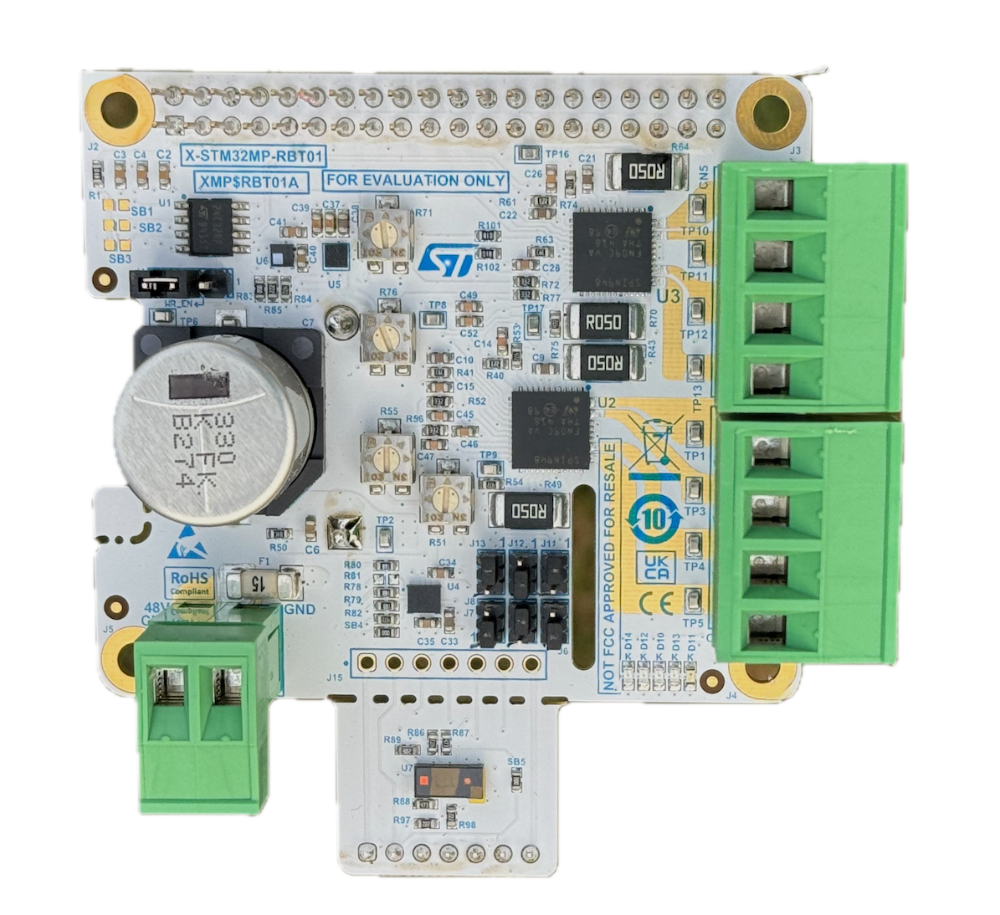
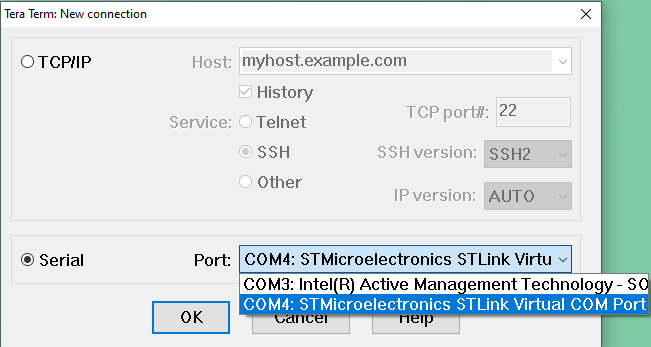
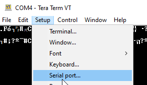
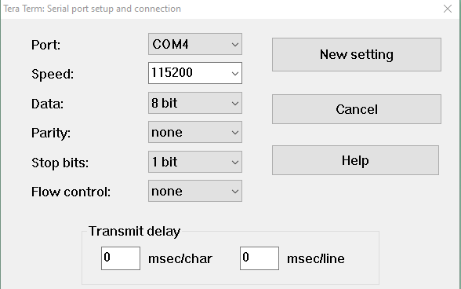
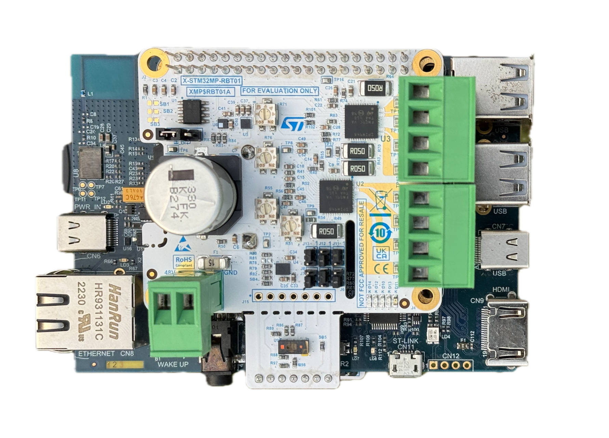
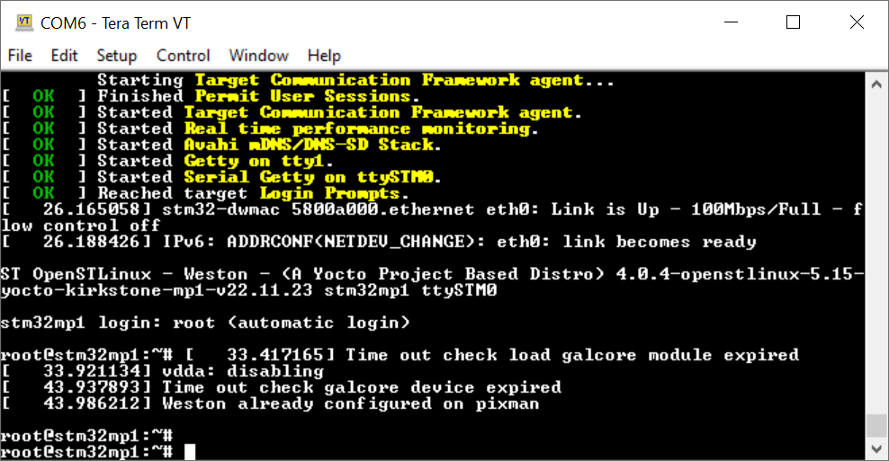
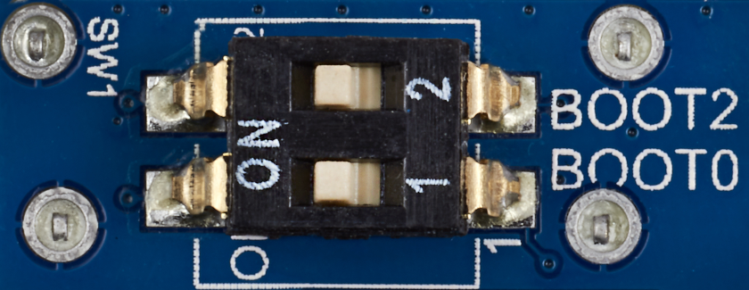

# X-STM32MP-RBT01 Testing Procedure (Under update)

## Introduction
This document provides a detailed procedure for testing the X-STM32MP-RBT01 Robotics expansion board. The board can be used with any MPU board having the 40 pin GPIO header. The current document demonstrate the usage with the STM32MP157F-DK2 Discovery Kit. 

## Setup Instructions

### Equipment Required
To conduct the tests, the following hardware is necessary:

- **Board 1:** STM32MP157F-DK2 Discovery Kit


- **Board 2:** X-STM32MP-RBT01 expansion board 
  
 

- **PC:** Laptop or Desktop with Linux or Windows 10 or above.
- **Cable1:** USB Type A to Type B (micro) USB cable.
- **Cable2:** USB PD compliant 5V, 3A power supply with USB Type-C to Type-C cable.

### Prepare the SD Card 
- If you have been provided with a SD Card Image (.img) file, flash it to the SD Card using a tool like [Balena Etcher](https://etcher.balena.io/).
- If the card image file is not provided, first flash the OpenSTLinus [starter package](https://www.st.com/en/embedded-software/stm32mp1starter.html) image using these [instructions](https://wiki.st.com/stm32mpu/wiki/STM32MP15_Discovery_kits_-_Starter_Package).

### Connecting the Hardware


1. Insert MicroSD-Card (with testing software) into SD Card slot on Discovery-kit (STM32MP157F-DK2). Ignore this instruction if the SD card is already installed.  
2. Connect USB micro-B cable to the Discovery-kit (CN11), other end to Desktop/laptop computer. The red LED (LD4) near to the USB micro-B connector should glow.   
4. Open ‘Tera-Term’ on Desktop. In the Serial option, note the COM port with the STMicroelectronics prefix, then close the dialog by pressing the cancel button.

In the Menu → Setup → Serial Port
Select COM port (noted in last step) as shown below

Set speed to **115200** and click **New Open** as shown below
   


## Testing Procedure
#### Test Execution  
1. Mount the X-STM32MP-RBT01 (board 2) on top of STM32MP157F-DK2 (board 1), this may require removing the LCD screen of **board 1**.
        
2. Connect a jumper between pins 1-2(WR_EN) of J1 on X-STM32MP-EVG01 expansion board.  
3. Connect Power cable to **PWR_IN (CN6)** on Discovery-Kit, Ensure that the Green LED LD2 near (Type C connector) is glowing. Blue LED (USB micro-B connector) is blinking.
4. At this point you must see boot logs scrolling on the Teraterm. Wait 30 seconds for logs to stop, then press **Enter** in terminal to get a Linux command prompt.
  
5. Navigate to software folder, where rbt1 package is present
    ```sh
    cd /usr/local/x-linux-rbt1/
    ```
6. Make the script executable 
`chmod +x rbt01_test.sh` 
7. Start the test script:
    ```sh
    ./test.sh
    ```
8. Follow test steps as prompted
9. When one board is tested, remove the USB Type C cable, remove the board carefully.
10. To test another board, repeat the procedure from **Step 1**


#### Test Acceptance Criteria
- Test passes when all modules return `PASS`.
- Expected output:
  ```
  **************************************
  VERDICT: BOARD OK
  **************************************
  ```
- If some tests fail, output will be:
  ```
  **************************************
  VERDICT: BOARD FAILED
  **************************************
  ```


## APPENDIX

### Boot Issues and Solutions
If the boot switches are disturbed during handling, the board may fail to boot. In this case:
- You will not see boot logs.
- The LED (LD6) between switches USER1 and USER2 will blink rapidly.

Note: This LED is hidden when the EVG01 board is installed.

**Fixing the Issue:**
1. Ensure the boot switches are configured correctly as shown in the image below.
 
2. Make sure the SD card is securely inserted.

If the boot switch configuration is correct and the SD card is valid:
- The blue LED (LD8) near the left side of the Micro-B connector will blink intermittently.
