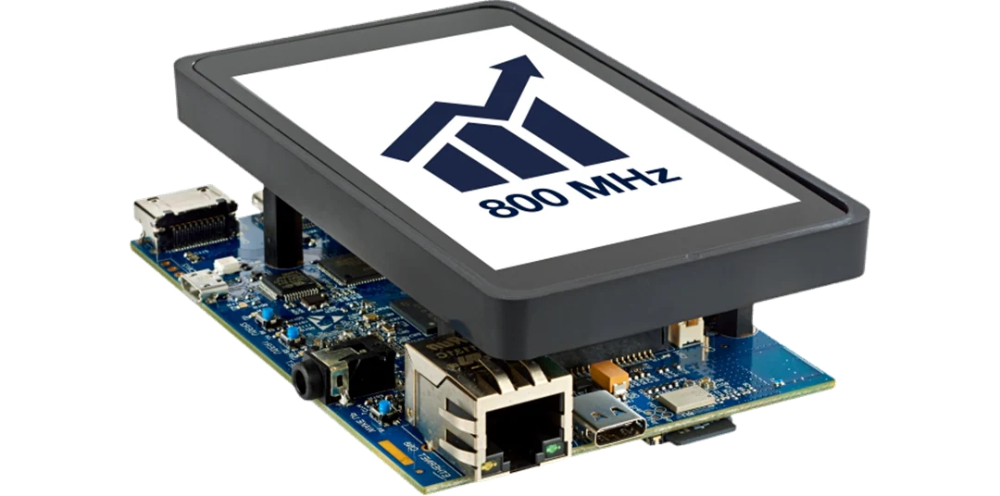
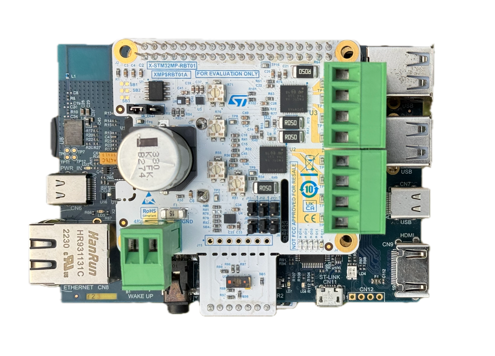
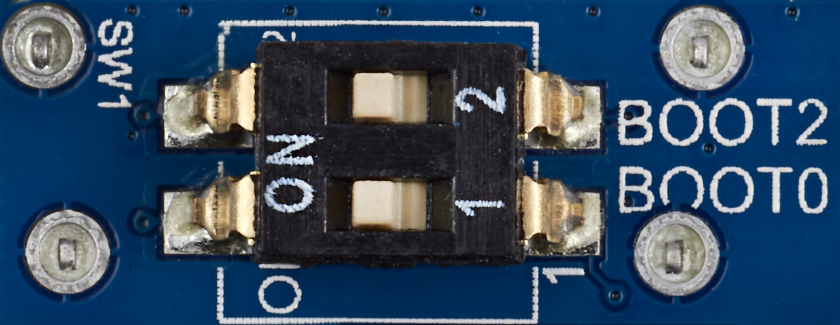

# X-STM32MP-RBT01 Testing Procedure (Under update)

## Introduction
This document provides a detailed procedure for testing the X-STM32MP-RBT01 Robotics expansion board. The board can be used with any MPU board having the 40 pin GPIO header. The current document demonstrate the usage with the STM32MP157F-DK2 Discovery Kit. 

## Setup Instructions

### Equipment Required
To conduct the tests, the following hardware is necessary:

- **Board 1:** STM32MP157F-DK2 Discovery Kit
  

- **Board 2:** X-STM32MP-RBT01 expansion board 
  
 

- **PC:** Laptop or Desktop with Linux or Windows 10 or above.
- **Cable1:** USB Type A to Type B (micro) USB cable.
- **Cable2:** USB PD compliant 5V, 3A power supply with USB Type-C to Type-C cable.

### Prepare the SD Card 
- If you have been provided with a SD Card Image (.img) file, flash it to the SD Card using a tool like [Balena Etcher](https://etcher.balena.io/).
- If the card image file is not provided, first flash the OpenSTLinus [starter package](https://www.st.com/en/embedded-software/stm32mp1starter.html) image using these [instructions](https://wiki.st.com/stm32mpu/wiki/STM32MP15_Discovery_kits_-_Starter_Package).

### Connecting the Hardware
1. Mount the X-STM32MP-RBT01 (board 2) on top of STM32MP157F-DK2 (board 1), this may require removing the LCD screen of **board 1**.
   
2. Connect **Board 1** to the PC using **Cable 1**, attaching it to CN11 (USB Type B mini) on the board and the standard USB port on the PC (refer to #5 in the image).
   

3. Open a serial port client (e.g., Tera-Term) on windows, *minicom* or *screen* on linux. Configure it to a baud rate of 115200 and select the "STMicroelectronics STLink Virtual COM Port".
  
  
    

4. Ensure that the boot switches are configured correctly (both BOOT1 and BOOT0 should be in 'ON' position)
   

5. Power up **Board 1** by connecting the **Power Cable** to CN6 (refer to #8 in the image above).
6. Allow **Board 1** some time to boot up. Monitor the boot logs that appear on the terminal.
7. Wait until the boot logs stop and command prompt is displayed on the terminal.

## Software Setup and Testing Procedure

1. Once the board is powered up, press 'Enter' to switch to input mode on the terminal.
2. Navigate to the directory containing the test script by typing `cd /usr/bin` and pressing 'Enter'.
3. Execute the test script by typing `./nfc_poller_st25r3916` and pressing 'Enter'.
4. Upon successful execution, an application startup message will appear on the terminal.
5. Bring the provided NFC Tag close to the antenna of **Board 2**.
6. Observe the "Type V" LED; it will start blinking when the NFC Tag is within range.
7. Confirm the detection with the message "Device(s) Found: 1" printed on the terminal, corresponding to the NFC Tag.

