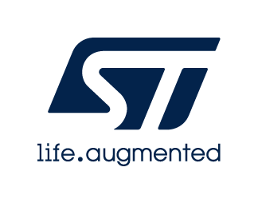

::: {.row}
::: {.col-sm-12 .col-lg-3}

# These are Additional License Terms for

# <mark>package X-LINUX-RBT1</mark>

Copyright &copy; 2025 STMicroelectronics

All rights reserved
    
{.logo}

:::

::: {.col-sm-12 .col-lg-9}
::: {.collapse}
<input type="checkbox" id="collapse-section2" checked aria-hidden="true">
<label for="collapse-section2" aria-hidden="true">__ANNEX 1: LIST OF SOFTWARE COMPONENTS (AND ASSOCIATED LICENSES) IN THE SOFTWARE PACKAGE__</label>

__SOFTWARE BILL OF MATERIALS__

| Component                         | Copyright             | License                                                      |
|:----------------------------------|:----------------------|:-------------------------------------------------------------|
| application > demo-launcher       | STMicroelectronics    | [BSD-3-Clause](https://opensource.org/licenses/BSD-3-Clause) |
| application > navigation-app    | STMicroelectronics    | [ANNEX 1](#collapse-section1)                                |
| test                              | STMicroelectronics    | [ANNEX 2](#collapse-section2)                                |

:::

::: {.collapse}
<input type="checkbox" id="collapse-section1" checked aria-hidden="true">
<label for="collapse-section1" aria-hidden="true">__ANNEX 1 - SLA0051__</label>

**SLA0051 Rev 3/May 2020**

## Software license agreement

BY CLICKING ON THE "I ACCEPT" BUTTON OR BY UNZIPPING, INSTALLING, COPYING,
DOWNLOADING, ACCESSING OR OTHERWISE USING THIS SOFTWARE (HEREINAFTER
“SOFTWARE” MEANS THE RELATED SOFTWARE,DOCUMENTATION, OTHER MATERIALS,
AND ANY PARTS, PERMITTED MODIFICATIONS, AND PERMITTED DERIVATIVES THEREOF)
FROM STMICROELECTRONICS INTERNATIONAL N.V, SWISS BRANCH AND/OR ITS AFFILIATED
COMPANIES (“STMICROELECTRONICS”), THE RECIPIENT, ON BEHALF OF HIMSELF
OR HERSELF, OR ON BEHALF OF ANY ENTITY BY WHICH SUCH RECIPIENT IS EMPLOYED
AND/OR ENGAGED (“YOU”) AGREES TO BE BOUND BY THIS AGREEMENT.

You represent that you have the authority to enter into this Agreement. You
will comply with all laws, including export laws. STMicroelectronics’s
failure or delay to enforce this Agreement does not waive
STMicroelectronics’s rights. Swiss law, except conflict of laws, governs
this Agreement, and the parties consent to exclusive jurisdiction of courts in
Switzerland for litigation of this Agreement. Subject to the below disclaimer,
the redistribution, reproduction and use in source and binary forms of the
software or any part thereof, with or without modification, are permitted
provided that the following conditions are met:

1. Redistribution of source code (modified or not) must retain any copyright
notice, this list of conditions and the following disclaimer.

2. Redistributions in binary form, except as embedded into a microcontroller
or microprocessor device or a software update for such device, must reproduce
any copyright notice, this list of conditions and the following disclaimer
in the documentation and/or other materials provided with the distribution.

3. Neither the name of STMicroelectronics nor the names of other contributors
to this software may be used to endorse or promote products using or derived
from this software or part thereof without specific written permission.

4. This software or any part thereof, including modifications and/or
derivative works of this software, must be used and execute solely and
exclusively in combination with an integrated circuit that is manufactured
by or for STMicroelectronics and is an NFC tag, NFC dynamic tag, NFC reader,
or UHF reader.

5.No use, reproduction or redistribution of this software may be done in any
manner that would subject this software to any Open Source Terms. “Open
Source Terms” shall mean any open source license which requires as
part of distribution of software that the source code of such software is
distributed therewith or otherwise made available, or open source license
that substantially complies with the Open Source definition specified at
www.opensource.org and any other comparable open source license such as
for example GNU General Public License (GPL), Eclipse Public License (EPL),
Apache Software License, BSD license and MIT license.

6. STMicroelectronics has no obligation to provide any maintenance, support
or updates for the software.

7. The software is and will remain the exclusive property of STMicroelectronics
and its licensors. The recipient will not take any action that jeopardizes
STMicroelectronics and its licensors' proprietary rights or acquire any
rights in the software, except the limited rights specified hereunder.

8. Redistribution and use of this software partially or any part thereof
other than as permitted under this license is void and will automatically
terminate your rights under this license.

9. THIS SOFTWARE IS PROVIDED BY STMICROELECTRONICS AND CONTRIBUTORS "AS IS"
AND ANY EXPRESS, IMPLIED OR STATUTORY WARRANTIES, INCLUDING, BUT NOT LIMITED
TO, THE IMPLIED WARRANTIES OF MERCHANTABILITY, FITNESS FOR A PARTICULAR
PURPOSE AND NON-INFRINGEMENT OF THIRD PARTY INTELLECTUAL PROPERTY RIGHTS
ARE DISCLAIMED TO THE FULLEST EXTENT PERMITTED BY LAW. IN NO EVENT SHALL
STMICROELECTRONICS OR CONTRIBUTORS BE LIABLE FOR ANY DIRECT, INDIRECT,
INCIDENTAL, SPECIAL, EXEMPLARY, OR CONSEQUENTIAL DAMAGES (INCLUDING,
BUT NOT LIMITED TO, PROCUREMENT OF SUBSTITUTE GOODS OR SERVICES; LOSS OF
USE, DATA, OR PROFITS; OR BUSINESS INTERRUPTION) HOWEVER CAUSED AND ON
ANY THEORY OF LIABILITY, WHETHER IN CONTRACT, STRICT LIABILITY, OR TORT
(INCLUDING NEGLIGENCE OR OTHERWISE) ARISING IN ANY WAY OUT OF THE USE OF
THIS SOFTWARE, EVEN IF ADVISED OF THE POSSIBILITY OF SUCH DAMAGE EXCEPT AS
EXPRESSLY PERMITTED HEREUNDER.

10. NO LICENSE OR OTHER RIGHTS, WHETHER EXPRESS OR IMPLIED, ARE GRANTED UNDER
ANY PATENT OR OTHER INTELLECTUAL PROPERTY RIGHTS OF STMICROELECTRONICS OR
ANY THIRD PARTY.

:::

::: {.collapse}
<input type="checkbox" id="collapse-section2" checked aria-hidden="true">
<label for="collapse-section2" aria-hidden="true">__ANNEX 2 - SLA0094__</label>

**SLA0094 Rev2/May 2020**

## Software license agreement 

### ODE SOFTWARE LICENSE AGREEMENT ("Agreement")

BY INSTALLING, COPYING, DOWNLOADING, ACCESSING OR OTHERWISE USING THIS SOFTWARE OR ANY PART THEREOF (AND THE RELATED DOCUMENTATION) FROM STMICROELECTRONICS INTERNATIONAL N.V, SWISS BRANCH AND/OR ITS AFFILIATED COMPANIES (STMICROELECTRONICS), THE RECIPIENT, ON BEHALF OF HIMSELF OR HERSELF, OR ON BEHALF OF ANY ENTITY BY WHICH SUCH RECIPIENT IS EMPLOYED AND/OR ENGAGED AGREES TO BE BOUND BY THIS SOFTWARE LICENSE AGREEMENT. 

Under STMicroelectronics’ intellectual property rights, the redistribution, reproduction and use in source and binary forms of the software or any part thereof, with or without modification, are permitted provided that the following conditions are met: 

1. Redistribution of source code (modified or not) must retain any copyright notice, this list of conditions and the disclaimer set forth below as items 10 and 11. 

2. Redistributions in binary form, except as embedded into microcontroller or microprocessor device manufactured by or for STMicroelectronics or a software update for such device, must reproduce any copyright notice provided with the binary code, this list of conditions, and the disclaimer set forth below as items 10 and 11, in documentation and/or other materials provided with the distribution. 

3. Neither the name of STMicroelectronics nor the names of other contributors to this software may be used to endorse or promote products derived from this software or part thereof without specific written permission. 

4. This software or any part thereof, including modifications and/or derivative works of this software, must be used and execute solely and exclusively on or in combination with a microcontroller and/or microprocessor and another device manufactured by or for STMicroelectronics. 

5. No use, reproduction or redistribution of this software partially or totally may be done in any manner that would subject this software to any Open Source Terms. “Open Source Terms” shall mean any open source license which requires as part of distribution of software that the source code of such software is distributed therewith or otherwise made available, or open source license that substantially complies with the Open Source definition specified at www.opensource.org and any other comparable open source license such as for example GNU General Public License (GPL), Eclipse Public License (EPL), Apache Software License, BSD license or MIT license. 

6. STMicroelectronics has no obligation to provide any maintenance, support or updates for the software. 

7. The software is and will remain the exclusive property of STMicroelectronics and its licensors. The recipient will not take any action that jeopardizes STMicroelectronics and its licensors' proprietary rights or acquire any rights in the software, except the limited rights specified hereunder. 

8. The recipient shall comply with all applicable laws and regulations affecting the use of the software or any part thereof including any applicable export control law or regulation. 

9. Redistribution and use of this software or any part thereof other than as permitted under this license is void and will automatically terminate your rights under this license. 

10. THIS SOFTWARE IS PROVIDED BY STMICROELECTRONICS AND CONTRIBUTORS "AS IS" AND ANY EXPRESS, IMPLIED OR STATUTORY WARRANTIES, INCLUDING, BUT NOT LIMITED TO, THE IMPLIED WARRANTIES OF MERCHANTABILITY, FITNESS FOR A PARTICULAR PURPOSE AND NON-INFRINGEMENT OF THIRD PARTY INTELLECTUAL PROPERTY RIGHTS, WHICH ARE DISCLAIMED TO THE FULLEST EXTENT PERMITTED BY LAW. IN NO EVENT SHALL STMICROELECTRONICS OR CONTRIBUTORS BE LIABLE FOR ANY DIRECT, INDIRECT, INCIDENTAL, SPECIAL, EXEMPLARY, OR CONSEQUENTIAL DAMAGES (INCLUDING, BUT NOT LIMITED TO, PROCUREMENT OF SUBSTITUTE GOODS OR SERVICES; LOSS OF USE, DATA, OR PROFITS; OR BUSINESS INTERRUPTION) HOWEVER CAUSED AND ON ANY THEORY OF LIABILITY, WHETHER IN CONTRACT, STRICT LIABILITY, OR TORT (INCLUDING NEGLIGENCE OR OTHERWISE) ARISING IN ANY WAY OUT OF THE USE OF THIS SOFTWARE, EVEN IF ADVISED OF THE POSSIBILITY OF SUCH DAMAGE. 

11. EXCEPT AS EXPRESSLY PERMITTED HEREUNDER, NO LICENSE OR OTHER RIGHTS, WHETHER EXPRESS OR IMPLIED, ARE GRANTED UNDER ANY PATENT OR OTHER INTELLECTUAL PROPERTY RIGHTS OF STMICROELECTRONICS OR ANY THIRD PARTY. 

:::

:::
:::
