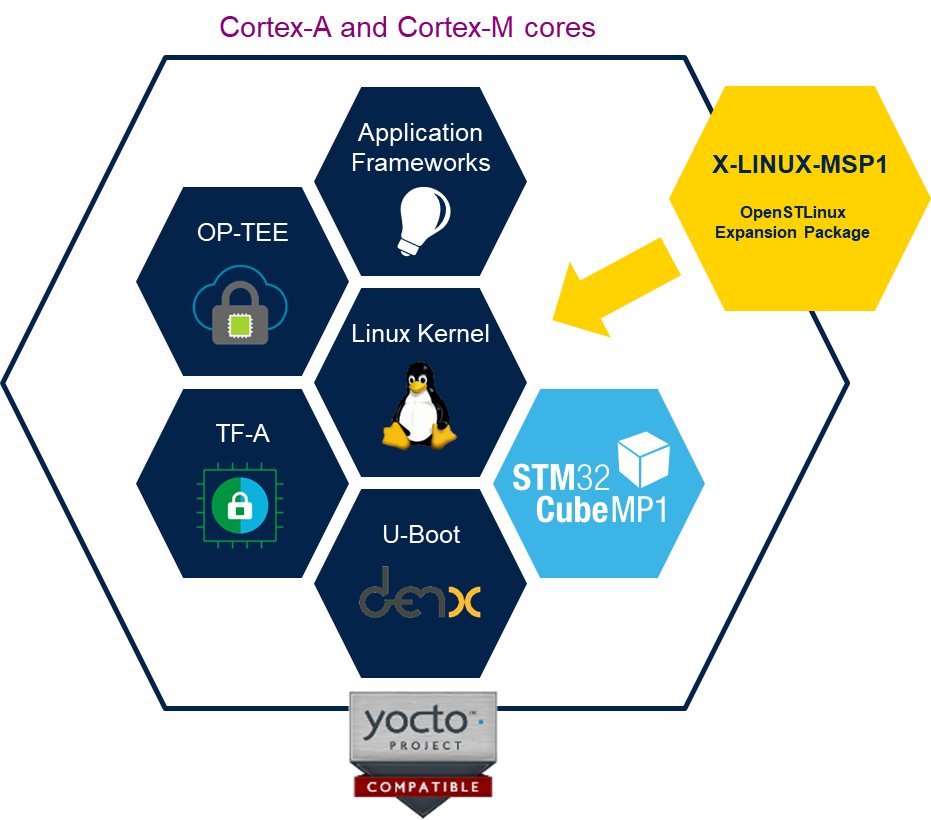
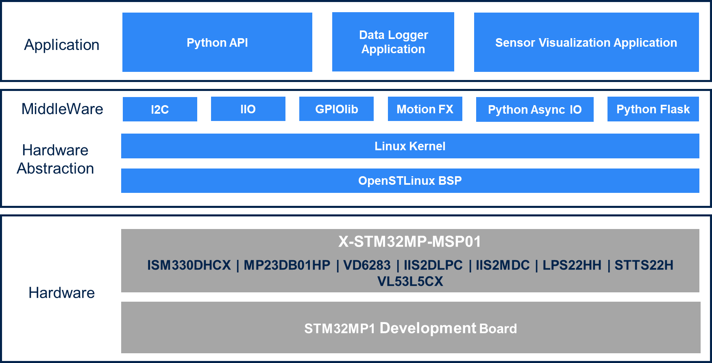
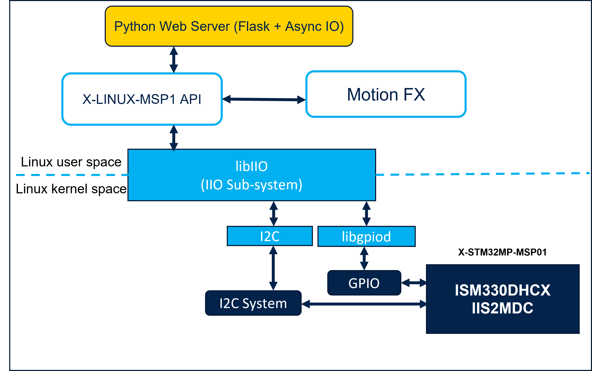
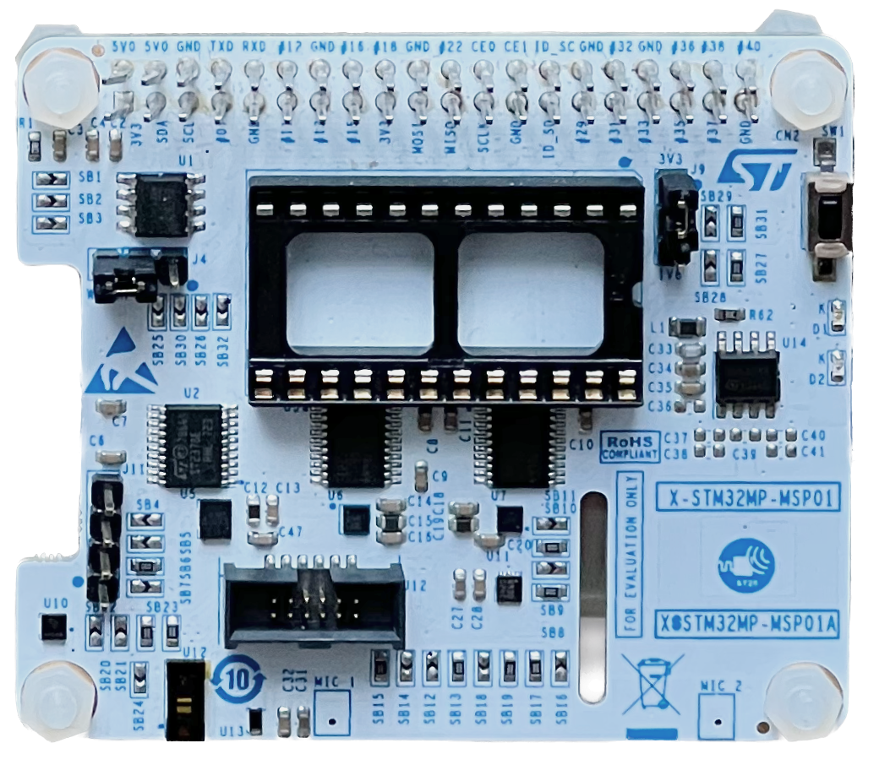
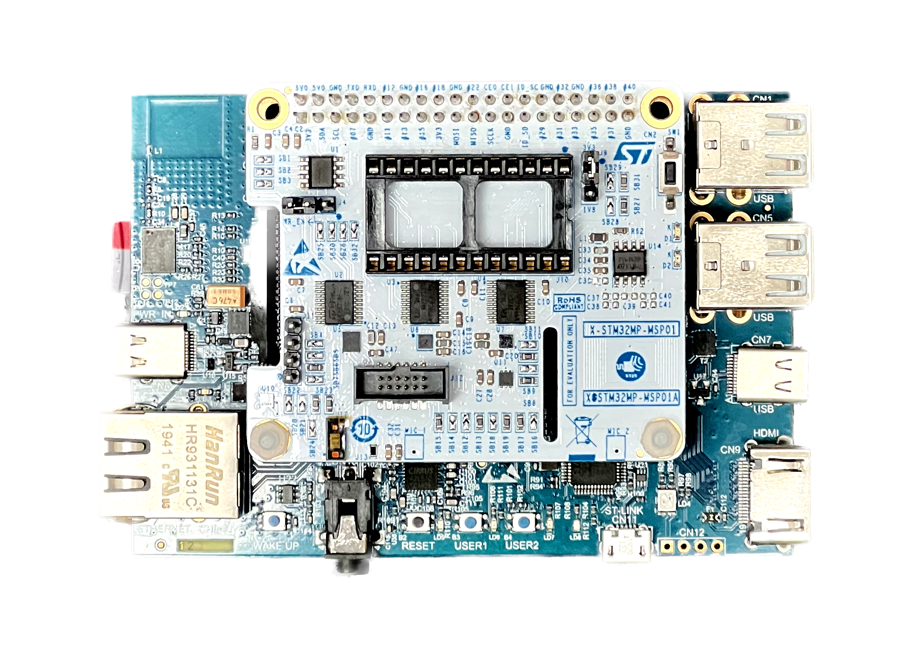
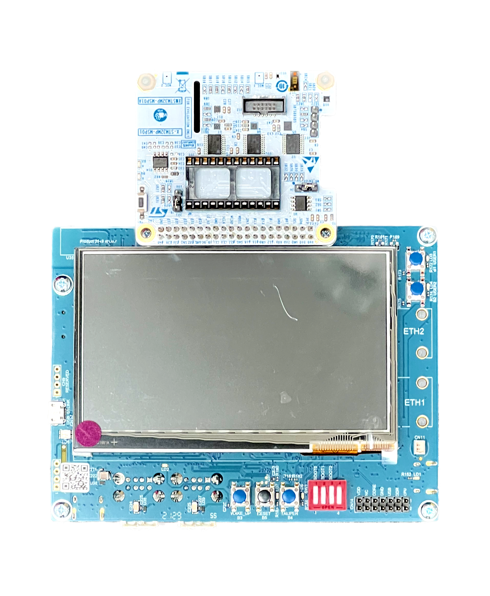

# X-LINUX-MSP1 Linux Package

## Introduction

[X-LINUX-MSP1](https://www.st.com/en/embedded-software/x-linux-msp1.html) is a software expansion package based on OpenSTLinux, designed to provide software support for the STMicroelectronics sensor expansion boards, which are compatible with the STM32MP microprocessor platform. These boards interface with the 40-pin header found on STM32MP1 discovery kits. The package comprises multiple Linux software components, including drivers, patches, APIs, and applications, to facilitate the creation of applications for multiple sensors available on the sensor expansion boards. Additionally, it includes a couple of demonstration applications that serve as foundational resources for the development of more complex sensor-based applications.




## 1 Overview

The [X-LINUX-MSP1](https://www.st.com/en/embedded-software/x-linux-msp1.html) package is designed for STMicroelectronics' sensor boards, compatible with the STM32MP microprocessor platform. It interfaces with the 40-pin header on STM32MP1 discovery kits. The package includes Linux software components such as drivers, patches, APIs, and applications, which are essential for developing applications using the sensors on the expansion boards. This package allows for effective sensor data collection from the connected sensor board using Linux system APIs. It includes functionalities for capturing, storing, and visualizing sensor data. The Motion FX Library, optimized for the Cortex A7 processor and ST sensors, processes data from MEMS sensors like accelerometer, gyroscope and magnetometer to provide accurate orientation and movement data.

Developers can use the package to create custom applications that utilize sensor data, with support for both local and network-based data visualization. The [X-LINUX-MSP1](https://www.st.com/en/embedded-software/x-linux-msp1.html) integrates with the Linux IIO subsystem for sensor configuration and data reading over interfaces like I2C. It also includes user-space drivers for the sensors for which IIO support is not available.


## 2 Description

### 2.1 Key Features and Components

The [X-LINUX-MSP1](https://www.STMicroelectronics.com/en/embedded-software/x-linux-msp1.html) software package provides various modules:

- Python API: This module provides an interface for interaction with the sensors, granting developers access to real-time data for application development purposes.
- Data Logger Application: A tool for recording sensor data, this application is useful for capturing and storing sensor readings for subsequent analysis.
- Sensor Visualization Application: This application graphically represents sensor data, enhancing the interpretability and usability of the sensor output.
- Data Streaming Application for Remote Visualization: This application hosts a web server to stream real-time sensor data over a network connection to be displayed visually on a web page using technologies like WebGL.


### 2.2 Applications and Usage

The [X-LINUX-MSP1](https://www.st.com/en/embedded-software/x-linux-msp1.html) expansion software package is a useful tool for developers working in areas such as environmental monitoring, industrial, and spatial awareness applications. It allows developers to prototype using STMicroelectronics sensors on a microprocessor platform running Linux.


### 2.3 X-LINUX-MSP1 Architecture

The software uses the Linux IIO subsystem to configure and read sensor data over the I2C bus, while "Time of Flight" and "Ambient Light Sensor" use user-space drivers to read data over the I2C bus. The Python APIs provide a unified interface to access sensor data.



The provided sensor data visualization applications are built on top of the Python APIs and provide an intuitive local and remote interface. Application developers could, however, write their own applications using the Python APIs provided with this package.




### 2.4 X-LINUX-MSP1 Package Structure

- **applications**: This folder contains sources and binaries for various applications, as detailed below:
    - **binaries**: pre-built application binaries to help get started quickly
    - **gtk-app**: GTK-based application to show sensor data locally on the MPU board LCD (if present). This component integrates with the demo-launcher application provided with the OpenSTLinux starter package
    - **sensor-sdk/api**: Python implementation of sensor APIs to access the sensor data in an easy way by the developers
    - Please note that some APIs may not work if the sensor visualization application is active
    - Python APIs provide a unified interface for various sensors for the developers. It is required for other components of the software to work. "test.py" provides the user with an example usage of the Python APIs

    - **sensor-sdk/web**: contains code for a simple web server for streaming the sensor data in real-time and a web application for visualizing the sensor data in a 3D environment. Note that "gtk-app" and "http-app" cannot run at the same time.
- **kernel/patches**: This folder contains the patches that need to be applied to the OpenSTLinux kernel to configure and enable the sensors on the supported sensor expansion boards.


## 3 Hardware Setup:

The current package provides software for the [X-STM32MP-MSP01 board](https://www.st.com/en/evaluation-tools/x-stm32mp-msp01.html) which integrates following devices: 

- ISM330DHCX 3-axis accelerometer and gyroscope
- IIS2MDC 3-axis magnetometer
- LPS22HH MEMS nano pressure sensor
- STTS22H digital temperature sensor
- VD6283TX ambient light sensor
- IIS2DLPC 3-axis accelerometer
- VL53L5CX multizone ranging sensor
- MP23DB02MM digital MEMS microphone*
- ST25DV64KC Dynamic NFC/RFID tag IC*

_(*) component support would be provided in the next version of the package_



The board allows developers to try out a variety of sensors and develop applications for them. The board can be used with the STM32MP157F-DK2 or STM32MP135F-DK discovery boards. The X-STM32MP-MSP01 board is designed to be mounted into the 40-pin connectors available on the top side of the discovery boards. The orientation of the sensor board when mounted on the MPU board depends on the type of MPU. Two examples are shown below. The software automatically detects the MPU board type and, thus, the orientation of the board and configures the output accordingly.


**X-STM32MP-MSP01 mounted on STM32MP157F-DK2**


**X-STM32MP-MSP01 mounted on STM32MP135F-DK**


## 4 Software Setup:

The section describes the software setup that is required for building, flashing, deploying, and running the application.


### 4.1 Recommended PC prerequisites

A Linux® PC running Ubuntu® 22.04 LTS is recommended to develop using the [X-LINUX-MSP1](https://www.st.com/en/embedded-software/x-linux-msp1.html) package. Please follow the below link for more information on the pre-requisites.
(https://wiki.st.com/stm32mpu/wiki/PC_prerequisites)


### 4.2 Software (and hardware) configuration on the STM32MP board

To effectively use the [X-LINUX-MSP1](https://www.st.com/en/embedded-software/x-linux-msp1.html) package, ensure that the necessary communication interfaces, such as I2C, are enabled and any interfaces that might interfere should be disabled. On embedded Linux platforms, the configuration of interfaces and GPIOs is typically managed through the device-tree system. Additionally, the use of certain Linux features may necessitate updating kernel options and enabling relevant kernel modules. The X-LINUX-MSP1 software package includes ready-made patches to assist in configuring both the device tree and kernel options, targeted for common STM32MP boards. In some scenarios, slight hardware adjustments may be required on the MPU board to facilitate optimal functionality. For more information on device tree configuration and any required hardware modifications for a specific MPU kit, it is advised to consult the documentation pertaining to the respective board. 


### 4.3 Configuring the Linux system on the MPU

There are three ways to configure the Linux system for [X-LINUX-MSP1](https://www.st.com/en/embedded-software/x-linux-msp1.html) on the STM32MP board:

1. Using the pre-built binaries, kernel modules, and device tree blobs
2. By building the application binaries, kernel modules, and device tree blobs from sources using the OpenSTLinux developer package (Yocto SDK)
3. Building the SD card image using the OpenSTLInux distribution package (based on the Yocto build system)

> To use methods 1 or 2, the user must create a bootable SD card using the OpenSTLinux starter package. After the bootable image is created, some pre-requisites must be installed on the MPU board. The Python packages "websockets", "asyncio", "aiohttp" are the prerequisites for the x-linux-msp1 software and must be installed onto the STM32MP board. This can be done by running the following command on the STM32MP board terminal:

    ```bash
    #Install required packages as follows
    apt-get install python3-<package-name>
    ```

The entire process is described below in detail in the following sections.


### 4.4 Create bootable media using the OpenSTLinux starter package

[OpenSTLinux starter package](https://www.st.com/en/embedded-software/stm32mp1starter.html) can be used to create a bootable SD card with a base software configuration.  
Follow the instructions on the STMicroelectronics wiki page [Populate the target and boot the image](https://wiki.st.com/stm32mpu/wiki/Getting_started/STM32MP1_boards/STM32MP157x-DK2/Let%27s_start/Populate_the_target_and_boot_the_image)

> Becuase the STM32CubeProgrammer is available on multiple platforms, you can use the starter package to create a bootable SD card even if you do not have access to a Linux machine, for example, using a Windows machine.


### 4.5 Evaluation using starter package: Using the pre-built binaries

The fastest way to experience the [X-LINUX-MSP1](https://www.st.com/en/embedded-software/x-linux-msp1.html) package is to copy the pre-build binaries provided with this package to the MPU board. The limitation of this approach is that the pre-built binaries are not guaranteed to run on a Linux version or platform other than the one for which they were created. There are several ways to copy the files (discussed in detail in *Section 4.7*). The following steps are required when copying the files to correct folders on the MPU board. 

1. Transfer the *.dtb files provided in the `kernel/<linux version>/binary` to the `/boot/` folder on the MPU. 
2. Copy the folder `applications/sensor-sdk` inside `/usr/local/demo` folder on the MPU.
3. Copy the content of `applications/binaries` to the `/usr/local/demo/sensor-sdk/api` 
4. Copy the contents of `applications/gtk-demo` to the `/usr/local/demo/application`, this would add an entry to the demo-launcher that comes with OpenSTLinux starter package.

The following script could be used to automate these steps to tranfer the files using the SCP protocol over a network connection.

```sh
cd <x-linux-msp1 folder>/applications
export BOARD_IP=<IP Address of the board>
ssh root@${BOARD_IP} "mkdir -p /usr/local/demo/sensor-sdk"
scp -r sensor-sdk/* root@${BOARD_IP}:/usr/local/demo/sensor-sdk/
scp binaries/* root@${BOARD_IP}:/usr/local/demo/sensor-sdk/api/
scp -r gtk-demo/* root@${BOARD_IP}:/usr/local/demo/application/
ssh root@${BOARD_IP} "sync"
```


### 4.6 Evaluation using developer package: Building from sources

Utilizing the Yocto SDK included in the OpenSTLinux developer package enables building application binaries, Linux kernel, modules, and device tree blobs (DTBs) from source. This approach aligns with standard Linux practices and allows developers to tailor the functionality of the application. Additionally, it facilitates the creation of binaries specifically targeted for a particular platform or Linux version.


#### 4.6.1 Building the Linux kernel, modules and device tree blobs (DTBs)

For the [X-LINUX-MSP1](https://www.st.com/en/embedded-software/x-linux-msp1.html) package communication interfaces and GPIOs can be configured by patching the device tree source files, followed by building the Linux kernel and device tree blobs. The newly built kernel and device tree blobs must be transferred to the SD card already flashed with the OpenSTLinux starter package. The steps to build the kernel and device tree are described below.

1. Download the developer package: Navigate to the [STM32MP1 OpenSTLinux Developer Package](https://www.st.com/en/embedded-software/stm32mp1dev.html) webpage. This webpage lists both the "STM32MP1Dev" package which contains the Linux sources, and the Yocto SDK package. Download both; you may need to have a user account on www.st.com in order to download the packages.
2. Install the Yocto SDK as described in the [STM32MP1 OpenSTLinux Developer Package](https://wiki.st.com/stm32mpu/wiki/STM32MP1_Developer_Package)
3. Unpack the contents of the source archive, typically named like "en.sources-stm32mp1-openstlinux-6.1-yocto-mickledore-mp1-v23.06.21.tar.gz"
4. In the extracted files, navigate to the Linux source folder, where you will find patches, configuration fragments, and the compressed Linux kernel source code.
5. From the X-LINUX-MSP1 package, copy the patches located in the `kernel/<linux version>/patches` directory to the Linux source folder.
6. Refer to the "README.HOW_TO.txt" file in the Linux sources folder. This document provides instructions for applying patches, configuring the kernel, and building the kernel and device tree blobs.
7. Copy the newly built kernel and device tree blobs to an SD card that already has the OpenSTLinux starter package flashed on it.


#### 4.6.2 Building the X-LINUX-MSP1 application binaries

The application sources provided in the `applications/sources` can be built using the Yocto SDK (you need to source the Yocto SDK before building). The steps to build the software are described below:

- **Build VL53L5CX_Linux_driver**

    1. Navigate to the folder `applications/sources/VL53L5CX_Linux_driver_1.1.2/user/test`
    2. run `make`

- **Build VD6283 ALS Application**

    1. Navigate to the folder `applications/sources/X-LINUX-VD6283-main`
    2. run `make`

Copy these binaries to the `application/binaries` folder and refer to the *section 4.5* for the instructions to transfer the file to the correct location on the MPU board.


### 4.7 Deploying the files to the MPU board

We need to transfer the built binaries, Python scripts, and application resources to the MPU Kit boards from the development PC. The developer can transfer the binaries using any of the following methods:

**Over a network connection**

1. Using a Linux host,'scp' is the preferred option
2. Using a Windows host, `WinSCP` could be used to copy the files to the MPU kit


Network connection could be established using a wired (Ethernet) connection or via a wireless connection using any of the following methods

- Hotspot method (https://wiki.st.com/stm32mpu/wiki/How_to_configure_a_wlan_interface_on_hotspot_mode)
- Setting up a Wi-Fi connection on the board Refer to *How to Setup a WLAN Connection" (https://wiki.st.com/stm32mpu/wiki/How_to_setup_a_WLAN_connection)


**Using any serial protocol** (like zmodem from Teraterm)
- Zmodem or kermit protocols could be used to tranfer files over the serial connection itself

**Copy using a USB storage device**

1. Copy the required files to the USB storage
2. Plugin the USB device into the MPU kit, use `lsblk` to list all the USB devices
3. Identify the USB device by its size and partition information.
4. Mount the device to a empty folder `mount /dev/<dev name> /path/to/mount/folder`
5. Copy files using `cp /path/to/usb/device/files/* /path/to/destination/directory` 


## 5 Using the X-LINUX-MSP1 Software

After the files have been copied to the MPU board, reboot the board. After reboot, the demo-launcher menu would now have an option added for X-LINUX-MSP1 package.

- **Using the GTK Application**: The X-LINUX-MSP1 GTK application could be launched using the OpenSTLinux demo launcher. The interface shows the sensor data in a graphical interface.

- **Using the Python APIs**: Go to the folder `/usr/local/demo/x-linux-msp1/api` and run the `api_test.py`. This script uses the Python APIs to display sensor data in a command-line interface. This script has proper code comments and serves as an example of how to use the APIs.

    ```bash
    # Go to the API folder
    Board>$ cd /usr/local/demo/sensor-sdk/api
    # run the API test script
    Board>$ python3 api_test.py
    ```

- **Using the data logger**: Go to the folder `/usr/local/demo/sensor-sdk/api` and run the `data_logger.py`. This script uses the Python APIs to log the sensor data to a specified file. By default the script would log data for all the sensors, else you could specify which sensors' data you would like to capture. You can provide the name of specific sensors or sensor categories to enable logging. The following arguments are supported:

- ism330dhcx, iis2mdc, lps22hh, stts22h, vd6283tx, iis2dlpc, vl53l5cx
- motion-sensors: selects all motion sensors
- imu: selects IMU
- tof: selects ToF available on the board
- als: selects the ALS available on the board

    ```bash
    # Go to the API folder
    Board>$ cd /usr/local/demo/sensor-sdk/api
    # run the logger script
    Board>$ python3 data_logger.py motion-sensors > sensor_data.log
    ```

- **Using the Sensor Visualization remote application**: Go to the folder `/usr/local/demo/sensor-sdk/web` and run the web server. This starts a basic web application which captures and streams the sensor data over a web-socket connection. 

```bash
# Go to the application folder
Board>$ cd /usr/local/demo/sensor-sdk/web
# run the web-socket server (in background)
Board>$ python3 ws_server.py &
# run the http (web) server
Board>$ python3 http_server.py
```

Now open the browser on a PC connected to the same network as the STM32MP1 board and enter the IP address of the board in the address bar. The browser should display the sensor data in a 3D environment.

> Note: The included web server is good only for use in a local network, security aspects should be considered before deploying it to public internet.

## 6 License

Details about the terms under which various components are licensed are available [here](Package_license.md)  
More detailed information about the licenses used in OpenSTLinux is available [here](https://wiki.st.com/stm32mpu/wiki/OpenSTLinux_licenses).


## 7 Release notes

Details about the content of this package are available in the release note [here](Release_Notes.md).


## 8 Compatibility information

The software package is validated for the [OpenSTLinux](https://www.st.com/en/embedded-software/stm32-mpu-openstlinux-distribution.html) version 5.0 (based om Linux 6.1.18). For running the software on other ecosystem versions customization may be needed.

The software is tested on the [STM32MP157F-DK2](https://www.st.com/en/evaluation-tools/stm32mp157f-dk2.html) board and [STM32MP135F-DK](https://www.st.com/en/evaluation-tools/stm32mp135f-dk.html) board. The software is expected to work on other STM32MP1 boards as well, but this is not validated.


## 9 Related Information and Documentation:

- [X-STM32MP-MSP01](https://www.st.com/en/evaluation-tools/x-stm32mp-msp01.html)
- [STM32MP157F-DK2](https://www.st.com/en/evaluation-tools/stm32mp157f-dk2.html)
- [STM32MP135F-DK](https://www.st.com/en/evaluation-tools/stm32mp135f-dk.html)
- [MotionFX](https://www.st.com/resource/en/user_manual/um2220-getting-started-with-motionfx-sensor-fusion-library-in-xcubemems1-expansion-for-stm32cube-stmicroelectronics.pdf)
- Sensors
    - [ISM330DHCX](https://www.st.com/en/mems-and-sensors/ism330dhcx.html)
    - [IIS2MDC](https://www.st.com/en/mems-and-sensors/iis2mdc.html)
    - [LPS22HH](https://www.st.com/en/mems-and-sensors/lps22hh.html)
    - [STTS22H](https://www.st.com/en/mems-and-sensors/stts22h.html)
    - [VD6283TX](https://www.st.com/en/imaging-and-photonics-solutions/vd6283tx.html)
    - [IIS2DLPC](https://www.st.com/en/mems-and-sensors/iis2dlpc.html)
    - [VL53L5CX](https://www.st.com/en/imaging-and-photonics-solutions/vl53l5cx.html)
    - [MP23DB02MM](https://www.st.com/en/mems-and-sensors/mp23db02mm.html)
    - [ST25DV64KC](https://www.st.com/en/nfc/st25dv64kc.html)
